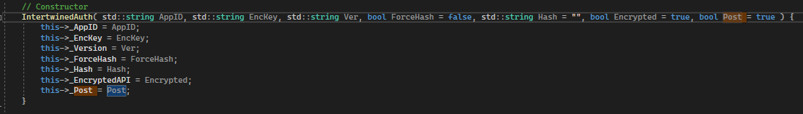

# Intertwined-CPP-Example
 This is the official CPP example for the unencrypted and encrypted APIs of https://intertwined.solutions.

# Usage

<b>Constructing the class</b>

- Appid - Found in the dashboard
- EncKey - Found in the dashboard
- Ver - The version to upload to check against the stored version
- ForceHash (optional) - Force the hash to be checked
- Hash (optional) - The hash to upload to check against the stored hash
- Encrypted (optional) - Force the client to connect to the encrypted API

<b>Class functions</b>

- Init - Calls [Init](https://github.com/UntitledEntity/intertwined-web/blob/9a5cae413ea140d5c60703083ab039c23fe6cfb8/api/encrypted.php#L78-L132) in the API.
- Login - Validates user information using a username and password, which will validate the session.
- LoginLicese - Validates a license, which will validate the session.
- Register - Registers a user with a username and password with a provided license
- Webhook - Calls a webhook with a provided ID. If configured, it will require a valid session.
- GetVariable - Gets a server-stored variable with a provided ID. If configured, it will require a valid session.
- Close - Closes the session created when calling Init.
- GetLastError - Gets the last error provided by the latest called function, which failed.

# Dependencies
- [Cryptopp](https://github.com/weidai11/cryptopp)
- [Curl](https://github.com/curl/curl)
- [nlohmann/JSON](https://github.com/nlohmann/json)

## License

> Copyright (c) 2023 Jacob Gluska/UntitledEntity

This project is licensed under the [GNU Affero General Public License v3.0](https://www.gnu.org/licenses/agpl-3.0.en.html) - see the [LICENSE](https://github.com/UntitledEntity/intertwined-web/blob/main/LICENSE) file for details.

### Please note that this license only applies to the code in this repository. This license does not apply to the Intertwined brand.
